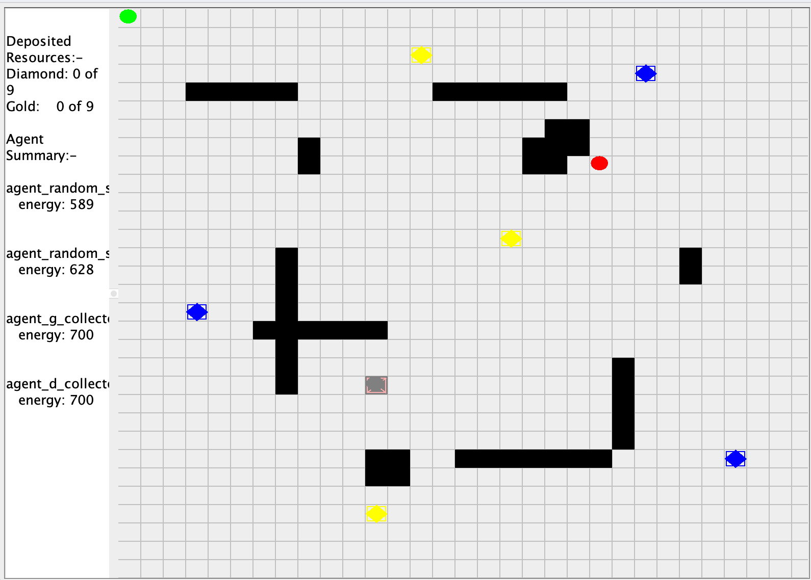

Rover agent project Using Jason AgentSpeak

Various rovers are used in collaboration in order to collect resources across the different scenarios. 

in the example below, 2 scanners and 2 collectors are used to manoeuvre around obstacles in order to 
collect the resources in the map.

